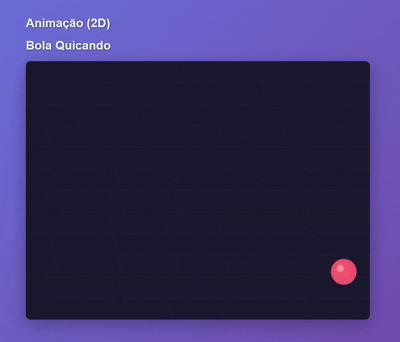

# Canvas Animations - Computação Grafica

Projeto de animações 2D e 3D desenvolvido com HTML Canvas e Three.js, contendo 5 cenários de física e movimento.

## Descrição

Este repositório contém 5 animações interativas que demonstram conceitos de física, movimento e geometria computacional. Todas as animações são implementadas de forma simples e didática, ideal para aprendizado.

## Cenários Implementados

### 1. Bola Quicando com Colisão Elástica
Animação 2D de uma bola com raio 30 que se movimenta pela tela colidindo elasticamente com chão e paredes.

**Características:**
- Início no canto inferior esquerdo
- Velocidade vertical inicial: 10 unidades/frame
- Aceleração da gravidade: 0.5 unidades/frame²
- Período de ida e volta: 4 segundos
- Colisões elásticas (sem perda de energia)

**Demo:**

---

### 2. Movimento de Braço 2D
Simulação do movimento de um braço mecânico em 2D com duas articulações.

**Características:**
- Início: braço alinhado com a vertical
- Final: antebraço alinhado com a horizontal
- Comprimento do braço: 2 unidades
- Comprimento do antebraço: 3 unidades
- Velocidade angular do antebraço: 2x a velocidade do braço
- Duração do movimento: 2 segundos

**Demo:**

---

### 3. Partícula em Espiral
Animação 2D da vista superior (plano XY) de uma partícula se movendo em espiral através de semicírculos crescentes.

**Características:**
- Ponto inicial: (-20, 0)
- Centro inicial: (0, 0)
- Movimento anti-horário
- Raio dobra a cada passagem pelo eixo OX
- Centro sempre permanece no eixo OX
- Cada semicírculo: 4 segundos

**Demo:**

---

### 4. Círculo Rolando na Parede Interna (2D)
Vista superior do plano XY mostrando um círculo pequeno rolando dentro de um círculo maior.

**Características:**
- Círculo externo: raio 100 (fixo)
- Círculo interno: raio 25 (rolando)
- Movimento anti-horário
- Rolamento sem deslizar
- Ponto marcado demonstra o movimento
- Trajetória: hipocicloide
- Volta completa: 4 segundos

**Demo:**

---

### 5. Círculo Rolando em Plano Inclinado (3D)
Animação 3D com círculo rolando no perímetro de outro círculo inclinado.

**Características:**
- Círculo maior: raio 100, rotacionado 60° no eixo X
- Círculo menor: raio 25, perpendicular ao plano maior
- Quadrado circunscrito visualizado
- Ponto marcado demonstra rolamento sem deslizar
- Câmera rotativa automática
- Visualização 3D completa com eixos e grade

---

## Tecnologias Utilizadas

- **HTML5 Canvas**: Para animações 2D
- **JavaScript**: Lógica de animação e física
- **CSS3**: Estilização e layout
- **Three.js (r128)**: Para animação 3D (apenas animação 5)

## Licença

Este projeto está sob a licença MIT. Veja o arquivo `LICENSE` para mais detalhes.

## Autor

@aryMello - Ana Melo
