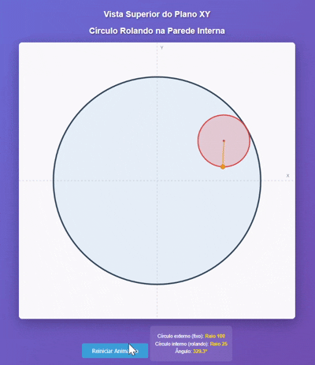

# Canvas Animations - Computação Grafica

Projeto de animações 2D e 3D desenvolvido com HTML Canvas e Three.js, contendo 5 cenários de física e movimento.

## Descrição

Este repositório contém 5 animações interativas que demonstram conceitos de física, movimento e geometria computacional. Todas as animações são implementadas de forma simples e didática, ideal para aprendizado.

## Lista 1 - Modelagem Geométrica

### 1. Operadores Afins Notórios
Implementação e visualização de três operadores afins fundamentais no R³.

**Características:**
- **Rotação** em torno da reta s = {(x, y, z) ∈ R³ | x = 2 e y = 1}
- **Reflexão** em relação ao plano C = {(x, y, z) | (0, 1, 0) + q(-2, 4, -2) + p(-1, -1, 1)}
- **Rotação helicoidal** em torno de D = (-t, 1-t, t) com fator de translação 2/π
- Animação de figura geométrica (quadrado de lado 1) executando as três operações
- Transições suaves entre transformações
- Matrizes em coordenadas homogêneas

**Demo:**

---

### 2. Simulação de Movimento com Rotações Afins
Simulação do movimento de uma partícula através de rotações afins em arco circular.

**Características:**
- Trajetória de A = (2, -2, -3) até B = (2, 1, 0)
- Arco circular centrado em C = (0, -1, -1)
- Movimento em incrementos de 30 graus
- Matrizes de transformação afim em coordenadas homogêneas
- Visualização da partícula percorrendo o arco

**Demo:**

---

### 3. Composição de Transformações
Operador afim composto por rotação, escala e translação.

**Características:**
- **Rotação** de 30° em torno da reta dirigida por (1, -1, 1) passando por (-1, 1, 0)
- **Escala** com fatores 3, -2 e 0,5 para x, y e z
- **Translação** (1, -2, -3)
- Reflexão no plano x - y = 1
- Rotação anti-horária de 30° em torno da reta (t, 0, -t)
- Animação fluida de figura geométrica executando todas as operações
- Produto de matrizes em coordenadas homogêneas

**Demo:**

---

### 4. Animação do Pião com Dupla Rotação
Simulação de um pião com rotação composta em dois eixos diferentes.

**Características:**
- Pião com bico inicial em (1, 2, 0)
- **Rotação interna**: 4 voltas em torno do eixo r = {(x, y, z) | x = 1+q, 2-q, 0} a cada t segundos
- **Rotação externa**: eixo r gira em torno de s = {(x, y, z) | x = 2 e y = 1} dando 1 volta a cada t segundos
- Ponto marcado na frente do pião para visualizar a rotação
- Operadores afins parametrizados em função do tempo
- Visualização 3D completa

**Demo:**

---

### 5. Isneique - Entidade 4D (Serpente Dimensional)
Animação de uma entidade 4D atravessando o R³ com movimento espiral e reflexões.

**Características:**
- Fenda espacial delimitada pelos planos A = -2x + y - z = 1 e B = y + z = 1
- Movimento espiral em torno do eixo D = (-t, 1-t, t)
- Fator de translação: 2 unidades por volta
- Reflexão no plano C ao cruzar os planos A ou B
- Matrizes em coordenadas homogêneas na ordem correta
- Visualização do movimento da "serpente"
- **Bônus**: Análise de adaptações para planos A e B rotacionando em torno de D

**Demo:**

## Lista 2 - Animações de Física e Movimento

### 1. Bola Quicando com Colisão Elástica
Animação 2D de uma bola com raio 30 que se movimenta pela tela colidindo elasticamente com chão e paredes.

**Características:**
- Início no canto inferior esquerdo
- Velocidade vertical inicial: 10 unidades/frame
- Aceleração da gravidade: 0.5 unidades/frame²
- Período de ida e volta: 4 segundos
- Colisões elásticas (sem perda de energia)

**Demo:**

---

### 2. Movimento de Braço 2D
Simulação do movimento de um braço mecânico em 2D com duas articulações.

**Características:**
- Início: braço alinhado com a vertical
- Final: antebraço alinhado com a horizontal
- Comprimento do braço: 2 unidades
- Comprimento do antebraço: 3 unidades
- Velocidade angular do antebraço: 2x a velocidade do braço
- Duração do movimento: 2 segundos

**Demo:**

---

### 3. Partícula em Espiral
Animação 2D da vista superior (plano XY) de uma partícula se movendo em espiral através de semicírculos crescentes.

**Características:**
- Ponto inicial: (-20, 0)
- Centro inicial: (0, 0)
- Movimento anti-horário
- Raio dobra a cada passagem pelo eixo OX
- Centro sempre permanece no eixo OX
- Cada semicírculo: 4 segundos

**Demo:**

---

### 4. Círculo Rolando na Parede Interna (2D)
Vista superior do plano XY mostrando um círculo pequeno rolando dentro de um círculo maior.

**Características:**
- Círculo externo: raio 100 (fixo)
- Círculo interno: raio 25 (rolando)
- Movimento anti-horário
- Rolamento sem deslizar
- Ponto marcado demonstra o movimento
- Trajetória: hipocicloide
- Volta completa: 4 segundos

**Demo:**

---

### 5. Círculo Rolando em Plano Inclinado (3D)
Animação 3D com círculo rolando no perímetro de outro círculo inclinado.

**Características:**
- Círculo maior: raio 100, rotacionado 60° no eixo X
- Círculo menor: raio 25, perpendicular ao plano maior
- Quadrado circunscrito visualizado
- Ponto marcado demonstra rolamento sem deslizar
- Câmera rotativa automática
- Visualização 3D completa com eixos e grade

---

## Tecnologias Utilizadas

- **HTML5 Canvas**: Para animações 2D
- **JavaScript**: Lógica de animação e física
- **CSS3**: Estilização e layout
- **Three.js**: Para animação 3D

## Licença

Este projeto está sob a licença MIT. Veja o arquivo `LICENSE` para mais detalhes.

## Autor

@aryMello - Ana Melo
